# Contexto Completo da Aplicação Gerit

## Objetivo deste documento

Este documento consolida a leitura técnica do projeto atual `VianaHub.Global.Gerit`, cobrindo:

- visão geral da aplicação
- arquitetura e responsabilidades por camada
- mapa completo de pastas e responsabilidades
- fluxo de autenticação e autorização ponta a ponta
- mapa das entidades e relacionamentos de negócio
- observações sobre maturidade, estado atual e pontos de atenção

O conteúdo foi produzido a partir da estrutura real do repositório, dos documentos existentes e dos arquivos centrais de bootstrap, domínio, infraestrutura e API.

## Visão geral da aplicação

O Gerit é um backend construído em `ASP.NET Core 8`, organizado em camadas, com foco em operação SaaS multi-tenant, segurança baseada em JWT, controle de acesso por perfis e permissões, e cobertura de processos de CRM e operação de campo.

O sistema não é apenas uma API CRUD. Ele combina:

- gestão de tenants, planos e assinaturas
- autenticação e autorização RBAC
- CRM de clientes pessoa física e pessoa jurídica
- gestão operacional de funcionários, equipes, veículos e equipamentos
- visitas, contatos, anexos e status operacionais
- processamento em lote via CSV
- automação e manutenção por jobs agendados com Hangfire

## Composição da solution

A solution principal é `VianaHub.Global.Gerit.sln` e contém os projetos:

- `src/VianaHub.Global.Gerit.Api`
- `src/VianaHub.Global.Gerit.Application`
- `src/VianaHub.Global.Gerit.Domain`
- `src/VianaHub.Global.Gerit.Infra.Data`
- `src/VianaHub.Global.Gerit.Infra.Integration`
- `src/VianaHub.Global.Gerit.Infra.IoC`
- `src/VianaHub.Global.Gerit.Infra.Job`
- `tests/VianaHub.Global.Gerit.Tests`

Além disso, há pastas auxiliares em `src/` que não aparecem como projeto independente na solution, mas existem no repositório:

- `src/VianaHub.Global.Gerit.Application.Services`
- `src/VianaHub.Global.Gerit.Infra.Data.Repository.Business`
- `src/VianaHub.Global.Gerit.Infra.Messaging`

Essas pastas indicam que houve ou ainda há movimentos de reorganização/refatoração do código.

## Arquitetura da aplicação

### Estilo arquitetural

O projeto segue uma combinação prática de:

- DDD
- Clean Architecture
- separação por camadas
- domínio rico com serviços de domínio
- Application Services como orquestradores de caso de uso
- infraestrutura isolada para persistência, integração e automação

### Camadas

#### API

Responsável por:

- expor os endpoints HTTP
- agrupar rotas por contexto
- aplicar autenticação e autorização
- aplicar validação de entrada
- montar respostas HTTP padronizadas
- inicializar middlewares transversais

O bootstrap principal está em `src/VianaHub.Global.Gerit.Api/Program.cs`.

#### Application

Responsável por:

- orquestrar os casos de uso
- validar existência e unicidade
- decidir códigos semânticos como `409 Conflict` e `410 Gone`
- mapear DTOs
- acionar domínio e repositórios
- tratar uploads em lote e operações de borda da aplicação

Exemplo representativo:

- `src/VianaHub.Global.Gerit.Application/Services/Business/ClientAppService.cs`

#### Domain

Responsável por:

- entidades de negócio
- invariantes
- validadores de domínio
- serviços de domínio
- enums, helpers e contratos base

O domínio foi modelado em torno de Billing, Identity e Business.

#### Infra

Responsável por:

- EF Core e SQL Server
- repositórios
- mapeamentos ORM
- contexto de banco
- interceptadores de tenant
- seed de dados
- resiliência e telemetria
- jobs Hangfire
- integração de e-mail e serviços auxiliares

#### IoC

Responsável por:

- registrar dependências de todas as camadas
- associar interfaces a implementações
- centralizar o container de DI da aplicação

Arquivo principal:

- `src/VianaHub.Global.Gerit.Infra.IoC/DependencyInjection.cs`

## Bootstrap e pipeline HTTP

O arquivo `Program.cs` monta o pipeline principal com os seguintes blocos:

1. configuração do Serilog
2. validação de configuração
3. `DbContext` com SQL Server e interceptadores
4. Swagger
5. AutoMapper
6. autenticação JWT
7. autorização
8. rate limiting
9. CORS
10. Hangfire e dashboard
11. registro da infraestrutura pelo `AddGeritInfrastructure()`
12. inicialização do banco de dados
13. middlewares de localização e tratamento global de exceções
14. registro automático de endpoints via reflexão
15. endpoint de health check

O registro automático dos endpoints é feito por classes estáticas anotadas com `EndpointMapper`, descobertas em `EndpointMapperExtensions.cs`.

## Padrões transversais

### Notificações

A aplicação usa `INotify` e `Notify` para acumular mensagens de erro e status ao longo do fluxo sem depender de exceções para regras de negócio.

Isso permite:

- manter a API fina
- centralizar a resposta HTTP no middleware
- devolver mensagens padronizadas

### Tratamento global de exceções

O middleware `GlobalExceptionMiddleware`:

- captura exceções não tratadas
- converte erros em respostas JSON padronizadas
- registra logs estruturados com `ErrorId`
- trata casos específicos de `JsonException`, `AutoMapperMappingException`, `SqlException` e `DbUpdateException`

### Internacionalização

A aplicação possui serviço de localização próprio em `LocalizationService`.

Características atuais:

- cultura definida pelo header `Accept-Language`
- fallback para `pt-PT`
- merge de múltiplos arquivos JSON por cultura
- uso de chaves de tradução em API, Application, Domain e Swagger

Idiomas efetivamente presentes no repositório:

- `pt-PT`
- `en-US`
- `es-ES`

### Banco e inicialização

O startup chama `InitializeDatabaseAsync`.

Na prática, a inicialização pode:

- aplicar migrations do EF Core
- executar seed
- validar e aplicar partes do script `docs/sql/Create-Tables.sql`
- garantir tabelas, colunas, índices, funções e policies de segurança

Isso mostra uma abordagem híbrida:

- migrations do EF Core para parte do modelo
- SQL manual para recursos avançados de SQL Server

## Mapa completo de pastas e responsabilidades

### Raiz do repositório

#### `.github`

- arquivos de automação do repositório e integrações de fluxo de trabalho

#### `docs`

- documentação técnica, SQL, coleções de API, regras de negócio e arquivos de apoio

Subpastas relevantes:

- `docs/sql`: scripts de criação, evolução e manutenção de banco
- `docs/collection`: coleção Postman e ambientes
- `docs/rn`: regras de negócio documentadas
- `docs/samples`: arquivos CSV de exemplo para bulk upload

#### `src`

- código-fonte principal da aplicação

#### `tests`

- testes automatizados do projeto

#### `Dockerfile`

- empacotamento e execução da API em container

#### `swagger-temp.json`

- snapshot ou artefato temporário de contrato Swagger

### `src/VianaHub.Global.Gerit.Api`

Responsável pela camada de apresentação HTTP.

Subpastas:

- `Assets`: arquivos auxiliares de apoio, inclusive exemplos
- `Configuration`: setup de Swagger, JWT, CORS, rate limiting e configurações transversais
- `Converters`: conversores usados na API
- `Endpoints`: endpoints organizados por contexto de negócio
- `Filters`: filtros de autorização, validação e upload
- `Helpers`: extensões e helpers da camada HTTP
- `Localization`: arquivos JSON de mensagens localizadas
- `Middleware`: middlewares de localização e tratamento de exceção
- `ModelBinders`: binders customizados
- `Security`: suporte ao dashboard do Hangfire e segurança complementar
- `Services`: serviços próprios da API, como usuário atual e localização
- `Validators`: validações de rota e request da camada API
- `wwwroot`: customização visual do Swagger UI

### `src/VianaHub.Global.Gerit.Application`

Responsável pela orquestração dos casos de uso.

Subpastas:

- `Configuration`: configurações da camada de aplicação
- `Dtos`: contratos de entrada e saída
- `Interfaces`: contratos dos app services
- `Mappings`: perfis do AutoMapper
- `Services`: implementação dos casos de uso
- `Validators`: validações de request na camada de aplicação

### `src/VianaHub.Global.Gerit.Application.Services`

- pasta auxiliar encontrada no repositório
- atualmente contém ao menos um serviço de identidade
- sugere resquício de reorganização ou migração de classes para a pasta principal `Application/Services`

### `src/VianaHub.Global.Gerit.Domain`

Responsável pelo núcleo de negócio.

Subpastas:

- `Base`: classes e contratos base de domínio
- `Entities`: entidades por contexto
- `Enums`: enums de negócio
- `Helpers`: utilitários de domínio
- `Interfaces`: contratos de serviços e repositórios
- `ReadModels`: modelos de leitura e paginação
- `Services`: serviços de domínio
- `Tools`: notificações, criptografia e ferramentas auxiliares
- `Validators`: validadores de domínio por entidade

### `src/VianaHub.Global.Gerit.Infra.Data`

Responsável pela persistência e suporte de dados.

Subpastas:

- `Context`: `DbContext` e contexto de tenant
- `Interceptors`: interceptadores do EF Core para tenant e telemetria
- `Mappings`: mapeamentos de entidades para o banco
- `Repository`: repositórios EF Core
- `Resilience`: políticas de resiliência
- `Security`: provedor de segredo e apoio à segurança
- `Seeders`: seed inicial
- `Telemetry`: telemetria de banco
- `Tools`: extensões de banco e inicialização

### `src/VianaHub.Global.Gerit.Infra.Data.Repository.Business`

- pasta isolada no repositório
- contém implementação ligada a repositórios de negócio
- aparenta ser um artefato estrutural fora do padrão principal de `Infra.Data/Repository`

### `src/VianaHub.Global.Gerit.Infra.Integration`

- integrações externas
- atualmente há implementação `Messaging/NoOpEmailSender.cs`

### `src/VianaHub.Global.Gerit.Infra.IoC`

- container de DI
- centraliza registro de validators, app services, domain services, repositórios e serviços transversais

### `src/VianaHub.Global.Gerit.Infra.Job`

- agendamento e execução de jobs com Hangfire

Subpastas:

- `HostedServices`: sincronização automática de jobs
- `Interfaces`: contratos da camada de job
- `Jobs`: jobs de manutenção, segurança e limpeza
- `Services`: scheduler, executor e sincronização

### `src/VianaHub.Global.Gerit.Infra.Messaging`

- pasta encontrada fora dos projetos formais
- contém ao menos implementação `NoOpEmailSender`
- pode representar transição entre `Infra.Integration` e outro arranjo anterior

### `tests/VianaHub.Global.Gerit.Tests`

Projeto de testes com `xUnit`, `Moq` e `coverlet`.

Subpastas:

- `Api`
- `Application`
- `Domain`
- `Infra`

O projeto de testes existe e está estruturado por camada, mas o volume atual de testes ainda parece pequeno frente ao tamanho do sistema.

## Módulos funcionais expostos pela API

Hoje a API possui 47 arquivos de endpoint agrupados em:

### Billing

- `Plan`
- `Subscription`
- `Tenant`

### Identity

- `Auth`
- `User`
- `UserPreferences`
- `UserRole`
- `Role`
- `RolePermission`
- `Resource`
- `Action`
- `JwtKey`

### Business

- `AddressType`
- `AttachmentCategory`
- `Client`
- `ClientAddress`
- `ClientCompany`
- `ClientCompanyFiscalData`
- `ClientConsents`
- `ClientContact`
- `ClientHierarchy`
- `ClientIndividual`
- `ClientIndividualFiscalData`
- `ClientType`
- `ConsentType`
- `Employee`
- `EmployeeAddress`
- `EmployeeContact`
- `EmployeeTeams`
- `Equipment`
- `EquipmentType`
- `FileType`
- `Function`
- `OriginType`
- `Status`
- `StatusType`
- `Team`
- `Vehicle`
- `Visit`
- `VisitAddress`
- `VisitAttachment`
- `VisitContact`
- `VisitTeam`
- `VisitTeamEmployee`
- `VisitTeamEquipments`
- `VisitTeamVehicles`

### Job

- `Job`

## Fluxo de autenticação e autorização ponta a ponta

### 1. Entrada do usuário

Os endpoints públicos de autenticação estão em `AuthEndpoint`:

- `POST /v1/auth/register`
- `POST /v1/auth/login`
- `POST /v1/auth/refresh`
- `GET /v1/auth/tenants`

Esses endpoints:

- são anônimos
- usam rate limiting específico
- recebem DTOs validados
- delegam o fluxo ao `IAuthAppService`

### 2. Registro

No `RegisterAsync` o fluxo observado é:

1. validar `TenantId`
2. definir contexto de tenant no banco para requests não autenticados
3. verificar se o e-mail já existe dentro do tenant
4. gerar hash da senha
5. criar a entidade `UserEntity`
6. persistir via repositório
7. enviar e-mail por `IEmailSender`
8. limpar o contexto do tenant
9. retornar resposta sem token

### 3. Login

No `LoginAsync` o fluxo observado é:

1. validar `TenantId`
2. configurar o tenant no contexto de request e do banco
3. buscar usuário por e-mail no tenant
4. validar senha
5. validar se a assinatura do tenant está ativa e válida
6. gerar access token JWT com claims do usuário
7. gerar refresh token
8. salvar refresh token no banco
9. limpar contexto do tenant
10. retornar tokens e dados básicos do usuário

### 4. Construção do token JWT

Durante `GenerateAccessTokenAsync`:

1. são criadas claims básicas como `sub`, `tenant_id`, `email` e `jti`
2. roles do usuário são carregadas do banco
3. permissões são agregadas por recurso e ação
4. o payload recebe permissões em formato JSON
5. a chave RSA ativa do tenant é buscada
6. a chave privada é descriptografada usando a master key externa
7. o token é assinado com `RsaSha256`

Consequência arquitetural:

- cada tenant possui sua própria chave JWT
- o sistema suporta rotação de chave
- autorização pode ser feita sem consulta por requisição

### 5. Refresh token

No `RefreshAsync`:

1. o tenant é validado
2. o refresh token é carregado
3. o token é validado como ativo
4. o usuário é carregado
5. a assinatura do tenant é validada novamente
6. o refresh token antigo é revogado
7. um novo refresh token é emitido
8. um novo access token é gerado

### 6. Entrada de requests autenticados

Nos endpoints privados:

1. o cliente envia `Authorization: Bearer <token>`
2. o `JwtBearer` intercepta a requisição
3. o evento `OnMessageReceived` executa lógica customizada

### 7. Pré-validação do token para resolver o tenant

Antes de validar a assinatura, o sistema decodifica o payload do JWT sem validar a assinatura para extrair `tenant_id`.

Esse passo existe porque:

- as chaves públicas de validação estão no banco
- o banco usa isolamento por tenant com `SESSION_CONTEXT`
- para buscar a chave correta, o tenant precisa estar resolvido antes

O fluxo é:

1. extrair `tenant_id` do token bruto
2. salvar esse valor em `IRequestTenantContext`
3. deixar os interceptadores do EF Core propagarem esse tenant para o SQL Server

### 8. Resolução de chaves de assinatura

Ainda no `OnMessageReceived`:

1. o repositório de chaves JWT busca as chaves válidas no banco
2. as chaves públicas são convertidas em `SecurityKey`
3. elas são injetadas nos parâmetros de validação do JWT
4. o framework valida assinatura, issuer, audience e expiração

### 9. Tenant no banco e RLS

Os interceptadores de banco garantem que:

- requisições autenticadas usem o `tenant_id` do JWT
- requisições não autenticadas usem o `IRequestTenantContext`
- antes de cada comando SQL, seja chamado `sp_set_session_context`

Isso sustenta o RLS no SQL Server e evita vazamento entre tenants.

### 10. Autorização por perfil e permissão

Depois que o token é validado:

1. os endpoints usam `RequireAuthorization()`
2. filtros `CustomAuthorize` verificam roles permitidas
3. o `AuthorizationFilter` lê as claims do token
4. a autorização pode usar:
   - roles
   - claims `permission` no formato antigo
   - claim `permissions` com JSON agrupado por recurso e ação
5. se a permissão existir, o request segue
6. caso contrário, a resposta é `403 Forbidden`

### 11. Obtenção do usuário atual

O `CurrentUserApiService` extrai do contexto HTTP:

- `UserId`
- `TenantId`
- `UserName`
- `Email`
- IP
- User Agent

Esses dados são usados por app services e domínio para:

- `CreatedBy`
- `ModifiedBy`
- operações do tenant corrente
- auditoria e logs

### 12. Resposta final

Se houver falhas de regra, validação ou autorização:

- `INotify` acumula mensagens e status
- o middleware global converte isso em JSON padronizado

Se ocorrer falha técnica:

- o middleware captura a exceção
- gera `ErrorId`
- registra o log estruturado
- devolve erro amigável ao cliente

## Mapa das entidades e relacionamentos de negócio

## Contextos do domínio

O domínio está dividido em três macrocontextos:

- Billing
- Identity
- Business

### Entidades de Billing

- `PlanEntity`
- `SubscriptionEntity`
- `TenantEntity`
- `TenantAddressEntity`
- `TenantContactEntity`
- `TenantFiscalDataEntity`

#### Relações de Billing

- `Plan` define a base comercial contratada
- `Tenant` representa a organização cliente do sistema
- `Subscription` vincula tenant a plano e vigência contratual
- `TenantAddress`, `TenantContact` e `TenantFiscalData` complementam os dados cadastrais e fiscais do tenant

Leitura de negócio:

- um tenant pertence ao contexto comercial da plataforma
- um tenant pode ter uma ou mais assinaturas ao longo do tempo
- uma assinatura referencia um plano

### Entidades de Identity

- `ActionEntity`
- `JwtKeyEntity`
- `RefreshTokenEntity`
- `ResourceEntity`
- `RoleEntity`
- `RolePermissionEntity`
- `UserEntity`
- `UserPreferencesEntity`
- `UserRoleEntity`

#### Relações de Identity

- `User` pertence a um tenant
- `Role` pertence ao tenant e representa agrupamento de acesso
- `Resource` representa o alvo da autorização
- `Action` representa a operação permitida
- `RolePermission` liga `Role + Resource + Action`
- `UserRole` liga usuário a role
- `RefreshToken` liga usuário e tenant ao ciclo de renovação de sessão
- `JwtKey` representa as chaves ativas, rotacionadas e históricas do tenant
- `UserPreferences` guarda preferências de uso do usuário

Leitura de negócio:

- o modelo de identidade é multi-tenant
- a autorização é RBAC com granularidade por recurso e ação
- a autenticação é sustentada por JWT assinado com chave própria do tenant

### Entidades de Business

- `AddressTypeEntity`
- `AttachmentCategoryEntity`
- `ClientAddressEntity`
- `ClientCompanyEntity`
- `ClientCompanyFiscalDataEntity`
- `ClientConsentsEntity`
- `ClientContactEntity`
- `ClientEntity`
- `ClientFiscalDataEntity`
- `ClientHierarchyEntity`
- `ClientIndividualEntity`
- `ClientIndividualFiscalDataEntity`
- `ClientTypeEntity`
- `ConsentTypeEntity`
- `EmployeeAddressEntity`
- `EmployeeContactEntity`
- `EmployeeEntity`
- `EmployeeTeamEntity`
- `EquipmentEntity`
- `EquipmentTypeEntity`
- `FileTypeEntity`
- `FunctionEntity`
- `OriginTypeEntity`
- `StatusEntity`
- `StatusTypeEntity`
- `TeamEntity`
- `VehicleEntity`
- `VisitAddressEntity`
- `VisitAttachmentEntity`
- `VisitContactEntity`
- `VisitEntity`
- `VisitTeamEmployeeEntity`
- `VisitTeamEntity`
- `VisitTeamEquipmentEntity`
- `VisitTeamVehicleEntity`

## Relações principais do domínio de negócio

### Núcleo de clientes

`ClientEntity` é a raiz principal do CRM.

Relacionamentos mais prováveis e coerentes com o código e com os endpoints:

- `Client` possui tipo por `ClientType`
- `Client` pode possuir origem por `OriginType` ou enum de origem
- `Client` pode ter múltiplos `ClientContact`
- `Client` pode ter múltiplos `ClientAddress`
- `Client` pode ter estrutura de consentimentos em `ClientConsents`
- `Client` pode participar de hierarquia via `ClientHierarchy`
- `Client` pode assumir especialização de pessoa física em `ClientIndividual`
- `Client` pode assumir especialização de pessoa jurídica em `ClientCompany`

#### Especialização pessoa física

- `ClientIndividual` estende semanticamente o cadastro do cliente PF
- `ClientIndividualFiscalData` guarda dados fiscais específicos da pessoa física

#### Especialização pessoa jurídica

- `ClientCompany` estende semanticamente o cadastro do cliente PJ
- `ClientCompanyFiscalData` guarda dados fiscais específicos da empresa

### Contatos, endereços e consentimentos

- `AddressType` classifica endereços
- `ClientAddress` referencia `Client` e `AddressType`
- `ClientContact` referencia `Client`
- `ConsentType` classifica o tipo de consentimento
- `ClientConsents` liga o cliente aos consentimentos exigidos por negócio e compliance

### Hierarquia de clientes

`ClientHierarchy` representa relações como:

- matriz e filial
- empresa mãe e subsidiária
- relação pai e filho entre clientes

Isso reforça o caráter de CRM B2B do sistema.

### Núcleo de equipe e operação

- `Employee` representa funcionário ou membro operacional
- `EmployeeAddress` e `EmployeeContact` complementam cadastro
- `Team` representa agrupamento operacional
- `EmployeeTeam` liga funcionários a equipes
- `Function` representa função exercida pelo colaborador dentro do contexto operacional

### Ativos operacionais

- `Vehicle` representa veículos utilizados nas operações
- `Equipment` representa equipamentos operacionais
- `EquipmentType` classifica os equipamentos

### Visitas

`VisitEntity` é o centro do fluxo operacional atual.

Relacionamentos principais:

- `Visit` pode ter múltiplos `VisitAddress`
- `Visit` pode ter múltiplos `VisitContact`
- `Visit` pode ter múltiplos `VisitAttachment`
- `Visit` pode ter múltiplos `VisitTeam`
- `Visit` é classificada por status e possivelmente por tipo/origem

### Composição da equipe de visita

`VisitTeamEntity` representa a equipe destacada para uma visita.

Relações:

- `VisitTeam` pertence a uma `Visit`
- `VisitTeamEmployee` liga `VisitTeam` a `Employee`
- `VisitTeamEmployee` também referencia `Function`
- `VisitTeamVehicle` liga `VisitTeam` a `Vehicle`
- `VisitTeamEquipment` liga `VisitTeam` a `Equipment`

Leitura de negócio:

- uma visita pode ter uma ou mais equipes
- cada equipe em visita pode carregar seus próprios membros, veículos e equipamentos
- isso permite modelar deslocamento, alocação e composição operacional

### Status, anexos e arquivos

- `StatusType` classifica categorias de status
- `Status` representa status efetivos de negócio
- `AttachmentCategory` classifica anexos
- `FileType` classifica tipos de arquivo
- `VisitAttachment` representa os anexos associados às visitas

## Diagrama lógico simplificado do domínio

```mermaid
erDiagram

TENANTS ||--o{ USERS : has
TENANTS ||--o{ ROLES : has
TENANTS ||--o{ JWT_KEYS : has
TENANTS ||--o{ SUBSCRIPTIONS : owns
PLANS ||--o{ SUBSCRIPTIONS : defines

USERS ||--o{ USER_ROLES : has
ROLES ||--o{ USER_ROLES : assigned_to
ROLES ||--o{ ROLE_PERMISSIONS : grants
RESOURCES ||--o{ ROLE_PERMISSIONS : targets
ACTIONS ||--o{ ROLE_PERMISSIONS : allows
USERS ||--o{ REFRESH_TOKENS : owns
USERS ||--o{ USER_PREFERENCES : configures

CLIENT_TYPES ||--o{ CLIENTS : classifies
CLIENTS ||--o{ CLIENT_CONTACTS : has
CLIENTS ||--o{ CLIENT_ADDRESSES : has
ADDRESS_TYPES ||--o{ CLIENT_ADDRESSES : classifies
CLIENTS ||--o| CLIENT_INDIVIDUALS : may_be
CLIENTS ||--o| CLIENT_COMPANIES : may_be
CLIENT_INDIVIDUALS ||--o| CLIENT_INDIVIDUAL_FISCAL_DATA : has
CLIENT_COMPANIES ||--o| CLIENT_COMPANY_FISCAL_DATA : has
CLIENTS ||--o{ CLIENT_CONSENTS : has
CONSENT_TYPES ||--o{ CLIENT_CONSENTS : classifies
CLIENTS ||--o{ CLIENT_HIERARCHIES : parent_or_child

EMPLOYEES ||--o{ EMPLOYEE_CONTACTS : has
EMPLOYEES ||--o{ EMPLOYEE_ADDRESSES : has
EMPLOYEES ||--o{ EMPLOYEE_TEAMS : assigned
TEAMS ||--o{ EMPLOYEE_TEAMS : contains

EQUIPMENT_TYPES ||--o{ EQUIPMENTS : classifies
STATUS_TYPES ||--o{ STATUS : classifies

VISITS ||--o{ VISIT_ADDRESSES : has
VISITS ||--o{ VISIT_CONTACTS : has
VISITS ||--o{ VISIT_ATTACHMENTS : has
VISITS ||--o{ VISIT_TEAMS : allocates
ATTACHMENT_CATEGORIES ||--o{ VISIT_ATTACHMENTS : classifies

VISIT_TEAMS ||--o{ VISIT_TEAM_EMPLOYEES : includes
VISIT_TEAMS ||--o{ VISIT_TEAM_VEHICLES : uses
VISIT_TEAMS ||--o{ VISIT_TEAM_EQUIPMENTS : uses
EMPLOYEES ||--o{ VISIT_TEAM_EMPLOYEES : assigned
FUNCTIONS ||--o{ VISIT_TEAM_EMPLOYEES : role
VEHICLES ||--o{ VISIT_TEAM_VEHICLES : assigned
EQUIPMENTS ||--o{ VISIT_TEAM_EQUIPMENTS : assigned
```

## Exemplo de fluxo ponta a ponta de negócio

Um fluxo típico de módulo de negócio, como `Client`, funciona assim:

1. o endpoint recebe a requisição
2. o filtro de autorização garante perfil e permissão
3. o app service resolve o tenant e o usuário atual
4. o app service verifica existência ou duplicidade
5. a entidade é criada ou atualizada
6. o domínio valida regras de negócio
7. o repositório persiste via EF Core
8. `INotify` concentra mensagens de erro se necessário
9. o middleware monta a resposta HTTP final

Isso mantém:

- endpoint fino
- regra semântica no Application
- regra de negócio no Domain
- persistência na Infra

## Estado atual e leitura crítica do projeto

### Pontos fortes

- arquitetura em camadas bem definida
- separação razoável entre API, Application, Domain e Infra
- uso consistente de DI
- multi-tenancy sério com `SESSION_CONTEXT` e RLS
- JWT por tenant com rotação de chave
- autorização stateless por claims
- internacionalização centralizada
- tratamento global de exceções
- automação com Hangfire

### Sinais de transição ou débito técnico

- existem pastas fora da estrutura principal dos projetos formais
- há mistura de migrations com script SQL manual como fonte complementar de schema
- a documentação menciona alguns estados mais amplos que o runtime atual, como maior número de idiomas
- o volume de testes aparenta ser menor do que a complexidade do sistema
- há fallbacks de desenvolvimento ainda visíveis em pontos de runtime, como retorno default de tenant em `CurrentUserApiService`

### Leitura final

O estado atual do Gerit é o de um backend enterprise em evolução, já com base arquitetural consistente e com componentes sofisticados em segurança e multi-tenancy, mas ainda com sinais claros de crescimento incremental e estabilização em andamento.

Em termos práticos, o sistema já opera como uma plataforma multi-tenant orientada a negócio, não apenas como um conjunto simples de CRUDs.
