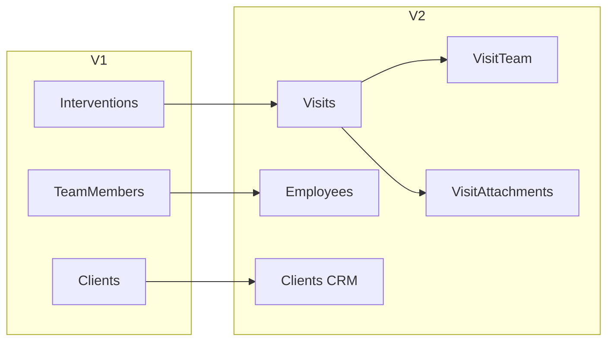
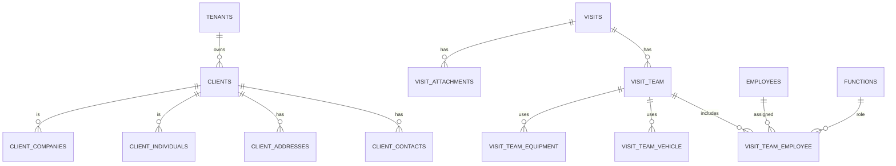

# Gerit – Evolução da Arquitetura e Modelo de Dados

## 📌 Visão Geral
A evolução entre as versões (v1) e (v2) demonstra uma transformação significativa do Gerit:

> De um sistema operacional técnico para uma plataforma SaaS multi-tenant, orientada ao negócio, escalável e com características enterprise.

---

## 🚀 Principais Evoluções

### 1. Mudança de conceito central
- **Intervention → Visit**
- Representa uma evolução semântica importante:
  - Mais genérico
  - Mais orientado ao negócio
  - Suporta múltiplos cenários (inspeção, atendimento, manutenção, etc.)

---

### 2. Refatoração de nomenclatura
- TeamMembers → Employees
- InterventionTeams → VisitTeam
- InterventionAttachments → VisitAttachments

📌 Resultado:
- Melhor legibilidade
- Alinhamento com linguagem de negócio

---

### 3. Evolução do módulo de equipes

#### v1
- Estrutura simples
- Sem controle temporal

#### v2
- Introdução de:
  - `VisitTeam`
  - `VisitTeamEmployee`
  - `Function`
  - Controle de início/fim

📌 Resultado:
- Gestão operacional completa de equipes

---

### 4. Evolução do módulo Clients (CRM)

#### v1
- Estrutura simples
- Dados pouco normalizados

#### v2
- Separação em:
  - ClientIndividuals
  - ClientCompanies
  - ClientContacts
  - ClientAddresses
  - ClientHierarchy
  - ClientFiscalData

📌 Resultado:
- Suporte a B2B e B2C
- Estrutura de CRM
- Hierarquia de clientes

---

### 5. Segurança e Multi-tenancy

#### v1
- Isolamento básico por TenantId

#### v2
- Row-Level Security (RLS)
- FKs compostas (Id + TenantId)

📌 Resultado:
- Isolamento real de dados
- Preparado para SaaS

---

### 6. Performance e escalabilidade

#### v2 introduz:
- Índices filtrados
- Índices compostos
- Otimização para queries reais

📌 Resultado:
- Melhor performance
- Escalabilidade horizontal

---

### 7. Evolução de anexos (Files)

- InterventionAttachments → VisitAttachments
- Melhor organização por categorias
- Integração com S3

📌 Resultado:
- Gestão robusta de ficheiros

---

### 8. Compliance (LGPD/GDPR)

#### v1
- Consent simples

#### v2
- Modelo estruturado de consentimento

📌 Resultado:
- Preparação para compliance legal

---

### 9. Sistema de automação

- JobDefinitions com:
  - CRON
  - Retry
  - Priority

📌 Resultado:
- Processamento assíncrono

---

## 🧠 Resumo Estratégico

| Aspecto | v1 | v2 |
|--------|----|----|
| Modelo | Técnico | Orientado ao negócio |
| Clientes | Básico | CRM estruturado |
| Operações | Simples | Completo |
| Segurança | Básica | RLS |
| Escalabilidade | Limitada | Alta |

---

## 🏗️ Diagrama de Evolução da Arquitetura

---

## 🗄️ DER (Diagrama Entidade-Relacionamento Simplificado)

---

## 🧾 Conclusão

A evolução do Gerit representa uma transformação arquitetural significativa:

- Adoção de princípios SaaS
- Domínio orientado ao negócio
- Introdução de CRM
- Segurança avançada
- Preparação para escala

> O sistema deixou de ser um backend operacional para se tornar uma plataforma completa de gestão de operações e clientes.

